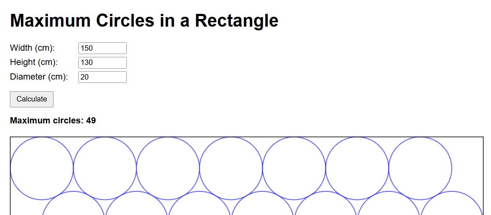

# Maximum Circles in a Rectangle

This project is a simple web-based tool that calculates the **maximum number of circles** that can fit inside a rectangle using a **hexagonal packing arrangement**. It also visualizes the rectangle and the circles on a responsive canvas.

## Features

- Input fields for:
  - Rectangle width (cm)
  - Rectangle height (cm)
  - Circle diameter (cm)
- Calculates the maximum number of circles that can fit without overlap
- Visualizes the arrangement of circles inside the rectangle
- Responsive canvas that adjusts to different screen sizes
- Automatic recalculation when the window is resized

## How to Use

1. Open the `index.html` file in a web browser.
2. Enter the **Width**, **Height**, and **Diameter** in centimeters.
3. Click the **Calculate** button.
4. The maximum number of circles will be displayed, and the arrangement will be drawn on the canvas below the inputs.

## How it Works

- Circles are arranged in a **hexagonal grid**, which is the most efficient way to pack circles in a rectangle.
- The algorithm checks for overlaps and adds extra rows at the bottom if possible.
- The canvas scales proportionally to the rectangle dimensions for a responsive display.

## Demo

  

## Tech Stack

- HTML
- CSS
- JavaScript (vanilla)

## License

This project is open-source and free to use.

